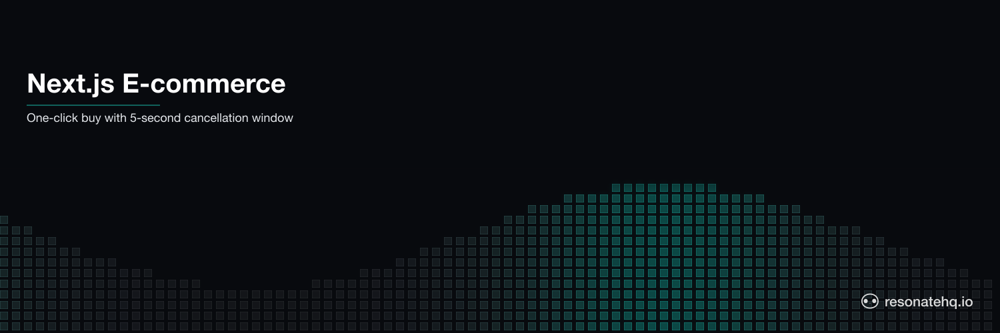

<p align="center">
  <picture>
    <source media="(prefers-color-scheme: dark)" srcset="./assets/banner-dark.png">
    <source media="(prefers-color-scheme: light)" srcset="./assets/banner-light.png">
    
  </picture>
</p>

# One-Click Buy with Cancellation Window

A minimal e-commerce checkout workflow demonstrating the one-click buy pattern: start a purchase, open a 5-second cancellation window, then confirm or cancel. Every step is durable — crash the process mid-checkout and restart with the same key, it resumes from where it left off.

This is a direct comparison to Temporal's [`nextjs-ecommerce-oneclick`](https://github.com/temporalio/samples-typescript/tree/main/nextjs-ecommerce-oneclick) sample.

## What This Demonstrates

- **One-click purchase flow**: buy → cancellation window → confirmed or cancelled
- **Idempotent checkout**: same key = same workflow, no double-charges
- **Durable cancellation window**: implemented with a timed EventEmitter race — no Signals, no Queries
- **Crash recovery**: kill the server mid-checkout, restart, complete the order

## Prerequisites

- [Bun](https://bun.sh) v1.0+

No external services. Resonate runs embedded.

## Setup

```bash
git clone https://github.com/resonatehq-examples/example-nextjs-ecommerce-ts
cd example-nextjs-ecommerce-ts
bun install
```

## Run It

```bash
bun start
```

Open [http://localhost:3000](http://localhost:3000) in your browser.

Click **Buy Now**, then either:
- Let the 5-second countdown expire → purchase confirmed
- Click **Cancel Order** before it expires → purchase cancelled

> If port 3000 is in use: `PORT=3001 bun start`

## Test via curl

```bash
# Start a purchase
KEY="buy-$(date +%s)"
curl -X POST "http://localhost:3000/buy/$KEY" \
  -H "Content-Type: application/json" -d '{"itemId":"widget-001"}'
# → {"status":"pending","key":"buy-..."}

# Wait 5 seconds, then check status
curl "http://localhost:3000/status/$KEY"
# → {"status":"done","result":{"state":"PURCHASE_CONFIRMED","orderId":"order-..."}}

# Or cancel within 5 seconds of buying:
curl -X POST "http://localhost:3000/cancel/$KEY"
curl "http://localhost:3000/status/$KEY"
# → {"status":"done","result":{"state":"PURCHASE_CANCELLED"}}
```

## The Workflow

The entire workflow is 15 lines in [`src/workflow.ts`](src/workflow.ts):

```typescript
export function* oneClickBuy(ctx: Context, itemId: string, key: string) {
  // Wait up to 5 seconds for a cancellation signal
  const decision = yield* ctx.run(waitForCancelOrTimeout, key, 5_000);

  if (decision === "cancelled") {
    yield* ctx.run(cancelledPurchase, itemId);
    return { state: "PURCHASE_CANCELLED", itemId };
  }

  const orderId = yield* ctx.run(checkoutItem, itemId);
  return { state: "PURCHASE_CONFIRMED", itemId, orderId };
}
```

The cancellation window is a regular async function wrapped in `ctx.run()`. No framework magic.

## File Structure

```
example-nextjs-ecommerce-ts/
├── src/
│   ├── main.ts        Express server, API routes, Resonate setup
│   ├── workflow.ts    One-click buy workflow + activity functions
│   └── bus.ts         In-process EventEmitter for HTTP ↔ workflow events
├── public/
│   └── index.html     Minimal product page with countdown UI
├── package.json
└── tsconfig.json
```

**Lines of code**: ~200 total. Workflow: 15 lines. API: ~40 lines. Frontend: ~100 lines HTML/JS.

## Comparison: Temporal vs Resonate

Temporal's [`nextjs-ecommerce-oneclick`](https://github.com/temporalio/samples-typescript/tree/main/nextjs-ecommerce-oneclick):

```typescript
// Temporal: Workflow
export async function OneClickBuy(itemId: string) {
  let purchaseState: PurchaseState = 'PURCHASE_PENDING';
  wf.setHandler(cancelPurchase, () => void (purchaseState = 'PURCHASE_CANCELED'));
  wf.setHandler(purchaseStateQuery, () => purchaseState);
  if (await wf.condition(() => purchaseState === 'PURCHASE_CANCELED', '5s')) {
    return await canceledPurchase(itemToBuy);   // ← Activity
  } else {
    purchaseState = 'PURCHASE_CONFIRMED';
    return await checkoutItem(itemToBuy);        // ← Activity
  }
}
```

Resonate equivalent:

```typescript
// Resonate: Workflow
export function* oneClickBuy(ctx: Context, itemId: string, key: string) {
  const decision = yield* ctx.run(waitForCancelOrTimeout, key, 5_000);
  if (decision === 'cancelled') {
    yield* ctx.run(cancelledPurchase, itemId);
    return { state: 'PURCHASE_CANCELLED', itemId };
  }
  const orderId = yield* ctx.run(checkoutItem, itemId);
  return { state: 'PURCHASE_CONFIRMED', itemId, orderId };
}
```

| | Resonate | Temporal |
|---|---|---|
| Workflow LOC | ~15 | ~10 |
| Concepts | `ctx.run()`, generator | Workflows, Activities, Signals, Queries, `wf.condition()`, `setHandler()` |
| Cancellation signal | EventEmitter inside `ctx.run()` | `wf.setHandler(signal)` |
| State query | HTTP poll via `/status/:key` | `wf.setHandler(query)` |
| Server required | No (embedded) | Yes (`temporal server start-dev`) |
| Total files | 3 source + 1 HTML | 4 Next.js pages + 4 Temporal files |

**Where Temporal wins**: built-in query support is more elegant than polling. The Web UI shows workflow history. Better for complex, long-running workflows.

**Where Resonate wins**: no server to run, fewer concepts, workflow + activity aren't separate file concerns. The cancellation window is just a Promise.

## Adapting to Next.js

The workflow and bus are framework-independent. To use with Next.js:

```typescript
// pages/api/buy/[key].ts
import { resonate } from "../../lib/resonate";
import { oneClickBuy } from "../../workflows/oneClickBuy";

export default async function handler(req, res) {
  const { key } = req.query;
  resonate.run(`checkout/${key}`, oneClickBuy, req.body.itemId, key).catch(console.error);
  res.json({ status: "pending", key });
}
```

The workflow code doesn't change — only the HTTP layer changes.

## Learn More

- [Resonate documentation](https://docs.resonatehq.io)
- [Temporal oneclick example](https://github.com/temporalio/samples-typescript/tree/main/nextjs-ecommerce-oneclick) — compare directly
- [Fault-tolerant checkout example](../example-fault-tolerant-checkout-ts/) — more complete checkout with payment webhooks
